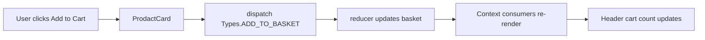

# Amazon Clone — Full-Stack E-Commerce

A **React + Vite** storefront with a **Node.js / Express** API and **MySQL** database. The goal is a production-style Amazon-like platform: your **database is the catalog source of truth** (not [Fake Store API](https://fakestoreapi.com)). The frontend still calls Fake Store temporarily until **Step 10** wires it to your API.

| Layer | Path | Status |
|-------|------|--------|
| Frontend | `amazonProject/frontend/` | UI shell (catalog still on Fake Store until Step 10) |
| Backend | `amazonProject/backend/` | DB ready; API steps 2+ pending |
| Database | `amazonProject/backend/src/db/` | **Step 1 complete** — 8 tables + seed |

### Step 1 — Database setup

See [`amazonProject/backend/src/db/README.md`](amazonProject/backend/src/db/README.md).

```powershell
cd amazonProject/backend
.\scripts\setup-db.ps1 -DbPassword your_mysql_password
```

Align `backend/.env` with the schema:

```env
DB_NAME=amazon_clone
DB_USER=root
DB_PASSWORD=your_password
```

**Demo accounts after seed:** `user@amazon.local` / `user123` · `admin@amazon.local` / `admin123`

---

## Front-end overview (legacy README below)

A **React** single-page application that recreates the look and feel of Amazon’s shopping experience. It currently still uses the Fake Store API in code; that will be replaced when the backend catalog API (Steps 4 + 10) is implemented.


---

## Table of Contents

- [Overview](#overview)
- [Features](#features)
- [Screens & Flows](#screens--flows)
- [Project Structure](#project-structure)
- [Architecture](#architecture)
- [Technologies Used](#technologies-used)
- [Installation](#installation)
- [Usage](#usage)
- [Code Documentation](#code-documentation)
- [API Reference](#api-reference)
- [Future Enhancements](#future-enhancements)
- [Author](#author)
- [License](#license)

---

## Overview

This project is a **client-side e-commerce demo** focused on:

- **Modular UI** — shared `LoyOut` (header + page content), product cards, category grid, and carousel on the home page.
- **Data from a REST API** — products and categories are loaded with **Axios**; loading states use a dedicated loader component.
- **Global cart state** — “Add to cart” dispatches actions through a small reducer; the header shows a live **basket item count**.
- **Amazon-inspired styling** — dark top header, search bar area, delivery strip, and lower navigation bar (Bootstrap + CSS modules + MUI where used).

It is suitable as a **portfolio piece** or **learning project** for React routing, context state, and API integration.

---

## Features

### Store & Catalog

| Feature | Description |
|--------|-------------|
| **Home landing** | Hero carousel, category cards, and grid of all products from the API. |
| **Category browsing** | Click a category to open `/category/:categoryName` with products for that category. |
| **Product detail** | `/products/:productId` shows image, title, rating, price, full description, and **Add to cart**. |
| **Ratings** | MUI `Rating` displays average score and review count from API data. |
| **Loading UX** | Spinner/loader while product and category requests are in flight. |

### Navigation & Layout

| Feature | Description |
|--------|-------------|
| **Sticky-style header** | Logo, delivery location, search UI, sign-in link, returns/orders link, cart with count. |
| **Lower header** | Secondary links (All, deals, customer service, etc.) for an authentic storefront shell. |
| **Consistent layout** | Pages wrap content with `LoyOut` so the header appears everywhere. |

### Cart & State

| Feature | Description |
|--------|-------------|
| **Add to cart** | From any product card or detail view; items are stored in global `basket`. |
| **Cart badge** | Header shows `state.basket.length`. |
| **Reducer pattern** | Typed actions via `Types` constants; easy to extend (quantity, remove, etc.). |

### Placeholder Routes (UI Shell)

The following routes exist with **layout and headings**; full business logic can be added incrementally:

| Route | Current state |
|-------|----------------|
| `/cart` | Placeholder — ready for line items, totals, and checkout CTA. |
| `/orders` | Placeholder — “no orders yet” message. |
| `/payment` | Placeholder — checkout/payment form area. |
| `/signup` | Placeholder — account / auth form area. |

---

## Screens & Flows

**Home** — Carousel → category row → all products.  
**Category** — Filtered grid using `GET /products/category/:category`.  
**Product** — Single product with optional wide layout and description.  
**Cart / Orders / Payment / Sign up** — Routed pages; implement forms and persistence as next steps.

*(Optional: add your own screenshots or a short screen recording here and link them under a “Demo” section.)*

---

## Project Structure

```text
amazonProject/
├── index.html
├── vite.config.js
├── eslint.config.js
├── package.json
├── src/
│   ├── main.jsx                 # Entry: StrictMode + DataProvider + App
│   ├── App.jsx
│   ├── Routering.jsx          # react-router-dom routes
│   ├── index.css
│   ├── Api/
│   │   └── endPoints.js       # API base URL
│   ├── Utility/
│   │   ├── actionType.js      # Reducer action constants
│   │   └── reducer.js         # basket state + ADD_TO_BASKET
│   ├── Pages/
│   │   ├── Landing/
│   │   ├── Cart/
│   │   ├── Orders/
│   │   ├── Payment/
│   │   ├── Results/           # Category listing (/category/:categoryName)
│   │   ├── ProductDetail/
│   │   └── Auth/
│   └── compenents/            # Shared UI (folder name as in repo)
│       ├── DataProvider/
│       ├── Header/
│       ├── LoyOut/
│       ├── Loader/
│       ├── Carousel/
│       ├── Category/
│       └── Prodact/
└── README.md
```

---

## Architecture

High-level layers:

```text
┌─────────────────────────────────────────────────────────────────┐
│                     REACT APPLICATION (Vite)                     │
├─────────────────────────────────────────────────────────────────┤
│  Routering.jsx          →  Page components (Landing, Results…)   │
│  LoyOut + Header        →  Global chrome, links, cart count      │
│  Prodact / ProdactCard  →  API fetch + product presentation      │
│  DataProvider           →  Context + useReducer(basket)          │
│  Fake Store API         →  HTTPS JSON (Axios)                    │
└─────────────────────────────────────────────────────────────────┘
```

**Data flow (add to cart):**



---

## Technologies Used

| Technology | Version (approx.) | Purpose |
|------------|-------------------|---------|
| [React](https://react.dev/) | 19.x | UI components and state |
| [Vite](https://vite.dev/) | 7.x | Dev server, HMR, production build |
| [React Router](https://reactrouter.com/) | 7.x | Client-side routing (`BrowserRouter`) |
| [Axios](https://axios-http.com/) | 1.x | HTTP client for Fake Store API |
| [Bootstrap](https://getbootstrap.com/) | 5.x | Layout / utility classes (where used) |
| [MUI](https://mui.com/) | 7.x | Icons, `Rating` component |
| [react-icons](https://react-icons.github.io/react-icons/) | 5.x | Additional icons |
| [react-responsive-carousel](https://www.npmjs.com/package/react-responsive-carousel) | 3.x | Landing carousel |
| [react-spinners](https://www.npmjs.com/package/react-spinners) | 0.x | Loading indicators |
| [ESLint](https://eslint.org/) | 9.x | Linting |

**Concepts demonstrated:** functional components, hooks (`useState`, `useEffect`, `useContext`, `useReducer`), controlled API lifecycle, shared layout, URL-driven views (`useParams`), and scalable action types for state updates.

---

## Installation

**Prerequisites:** [Node.js](https://nodejs.org/) (LTS recommended) and npm.

1. **Clone the repository:**

   ```bash
   git clone https://github.com/samuel9974/Amazon-Clone.git
   cd Amazon-Clone/amazonProject
   ```

2. **Install dependencies:**

   ```bash
   npm install
   ```

3. **Start the development server:**

   ```bash
   npm run dev
   ```

   Open the URL shown in the terminal (typically `http://localhost:5173`).

4. **Production build (optional):**

   ```bash
   npm run build
   npm run preview
   ```

---

## Usage

| Action | How |
|--------|-----|
| Browse all products | Open the home page `/`. |
| Shop by category | Click a category card; opens `/category/<api-category-name>`. |
| View product details | Click a product image or open `/products/<id>`. |
| Add to cart | Click **Add to Cart** on a card or detail page; watch the cart count in the header. |
| Open cart / orders / sign-in | Use header links (`/cart`, `/orders`, `/signup`). |

**Lint:**

```bash
npm run lint
```

---

## Code Documentation

### Global state shape

```js
{
  basket: [] // array of product objects added via ADD_TO_BASKET
}
```

### Product object (Fake Store API)

Key fields used in the UI include: `id`, `title`, `price`, `description`, `image`, `rating.rate`, `rating.count`, `category`.

### Important modules

| Module | Role |
|--------|------|
| `DataProvider.jsx` | Exposes `[state, dispatch]` via `DataContext`. |
| `reducer.js` | Updates `basket` on `Types.ADD_TO_BASKET`. |
| `Prodact.jsx` | Fetches `GET /products`, maps to `ProdactCard`. |
| `Results.jsx` | Fetches `GET /products/category/:categoryName`. |
| `ProductDetail.jsx` | Fetches `GET /products/:productId`. |
| `ProdactCard.jsx` | Renders card, link to detail, rating, price, add to cart. |
| `Header.jsx` | Navigation, search UI, cart count from context. |

---

## API Reference

Base URL is defined in `src/Api/endPoints.js`:

```text
https://fakestoreapi.com
```

| Endpoint | Used for |
|----------|----------|
| `GET /products` | Home page product grid |
| `GET /products/:id` | Product detail page |
| `GET /products/category/:category` | Category results page |

*No API key required for Fake Store API demo endpoints.*

---

## Future Enhancements

- **Persist cart** — `localStorage` or backend session.
- **Cart page** — Line items, quantity controls, remove item, subtotal/tax/shipping.
- **Search** — Wire header search to `/results` or a dedicated search route with query params.
- **Authentication** — Real sign-in/sign-up with a provider or custom API.
- **Checkout** — Multi-step shipping + payment (or Stripe integration).
- **Order history** — Store completed orders after checkout.
- **Tests** — Vitest + React Testing Library for critical flows.
- **TypeScript** — Stricter contracts for API responses and props.

---

## Author

**Samuel**

- GitHub: [@samuel9974](https://github.com/samuel9974)

---

## License

This project is provided for **educational and portfolio** use. Amazon® is a trademark of Amazon.com, Inc. This project is an independent UI exercise and is not affiliated with or endorsed by Amazon.

---

*Built with React, Vite, and vanilla REST integration—styled to echo a familiar e-commerce experience while staying easy to extend.*
